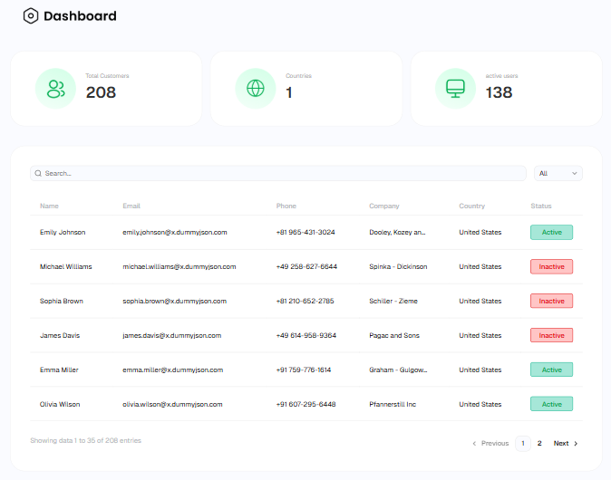

# Customer Data Explorer Dashboard

A fast, minimal **React + TypeScript dashboard** for exploring, managing, and operating on customer data.  
Built with Vite for high performance and a smooth developer experience.

---

## 🚀 Preview



> Add your own screenshot inside a `screenshots/` folder

---

## 🌐 Live Demo

👉 https://customer-data-explorer.netlify.app/

---

## 🎯 Purpose

- Provide a lightweight UI for inspecting customer datasets
- Enable fast search, filtering, and data exploration
- Serve as a foundation for internal tools and admin dashboards

---

## ✨ Features

- 🔍 Real-time search and filtering (client-side + API)
- 📊 Data insights with stats cards
- 🧾 Interactive table with sorting & pagination
- ✅ Row selection and bulk actions
- ✏️ Table operations (edit, delete)
- 🧩 Modular feature-based architecture
- ⚡ Fast performance with Vite

---

## 🛠️ Tech Stack

- React
- TypeScript
- Vite
- Tailwind CSS
- ShadCN UI

---

## ⚙️ Quick Start

### Prerequisites

- Node.js 18+
- npm / yarn / pnpm

---

### Installation

```bash
git clone <repo-url>
cd Customer-Data-Explorer-Dashboard
npm install
```
